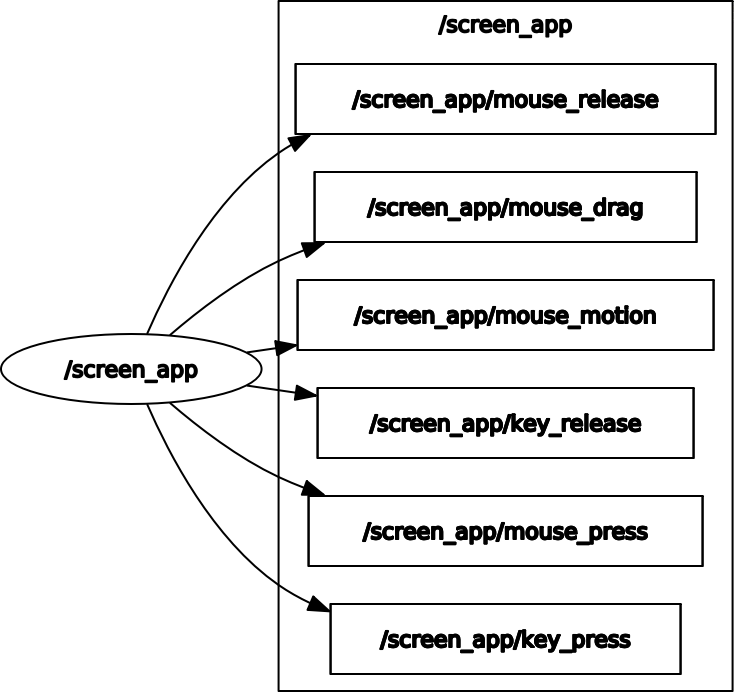

# A Simple Application for Monitoring Mouse and Key Events in ROS (2)

[](https://opensource.org/licenses/MIT)

## Overview

A simple application to monitor mouse and keyboard events via ROS 2.
Default size is 1920x1080, and the window is by default moved to the external screen: you can modify [AppWindow](screen_app/run_app.py) to change these.

See the main branch for a further simpler version to run on ROS 1 (Melodic).

### License

The whole package is under MIT License, see [LICENSE](LICENSE).

This README is based on the project [ros_best_practices](https://github.com/leggedrobotics/ros_best_practices), Copyright 2015-2017, Péter Fankhauser. It is licensed under the BSD 3-Clause Clear License. See [doc/LICENSE](doc/LICENSE) for additional details.

**Author: Utku Norman<br />
Affiliation: [CHILI Lab, EPFL](https://www.epfl.ch/labs/chili/)<br />
Maintainer: Utku Norman, utku.norman@epfl.ch**

The [screen_app] package has been tested under [ROS Foxy](https://docs.ros.org/en/foxy/) on Ubuntu 20.04.
This is research code, expect that it changes often and any fitness for a particular purpose is disclaimed.


## Installation

### Building from Source

#### Dependencies

* [Robot Operating System (ROS 2)](https://docs.ros.org) (middleware for robotics)
* [pyglet](https://pyglet.readthedocs.io/en/latest/) to visualise and interact with the activity from a role (human or the robot)


#### Building

1) [Install ROS Foxy](https://docs.ros.org/en/foxy/Installation.html).

2) Create a ROS workspace (e.g. `~/ros2_foxy`):
```
mkdir -p ~/ros2_foxy/src
cd ~/ros2_foxy/
source install/setup.bash
```

3) Clone this package:
```
cd ~/ros2_foxy
git clone https://github.com/utku-norman/screen_app.git
```

4) Make sure ros2 branch is checked out (which is also the default branch):
```
cd screen_app
git checkout ros2
```

5) Build this package with ROS (this also installs the justhink_scenario Python package):
```
cd ~/ros2_foxy
colcon build --symlink-install --packages-select screen_app
source install/setup.bash
```

6) Check the installation by running the following in a terminal:
```
ros2 interface show screen_app/msg/Mouse
```


## Usage

In another terminal, run the node with:
```
ros2 run screen_app run_app.py
```

### Running with a touch screen

#### Mapping the touch interface onto the touch screen

Check the name of the touch controller, e.g. "USBest Technology SiS HID Touch Controller"
```
xinput
```

2) Check the name of the screen, e.g. "DP-3"
```
xrandr -q
```

3) Map the touch controller to the screen, e.g., if it is DP-3 from the previous step:
```
xinput map-to-output "USBest Technology SiS HID Touch Controller" DP-3
```

#### Hiding the cursor on touch events

Install the fork of unclutter that hides the cursor for touch only (The default unclutter from apt does not have "-touch".)
```
sudo apt install asciidoc libev-dev libxslt1-dev docbook-xsl xsltproc libxml2-utils    # Prerequisites
git clone https://github.com/nowrep/unclutter-xfixes.git
cd unclutter-xfixes
make
sudo make install
```

5) Run unclutter on a separate terminal. Touch on the screen will not show cursor.
```
unclutter -touch
```

#### Rotating the screen by 180 degrees
To prevent the power button being pressed accidentally (normally bottom right corner, if rotated top left corner)

1) In Display setting of Ubuntu, change Rotation to 180 degrees.

2) Remap the touch upside-down.
```
xinput set-prop "USBest Technology SiS HID Touch Controller" --type=float "Coordinate Transformation Matrix" 0 -1 1 1 0 0 0 0 1
```


## Nodes

### screen_app

Launches a simple application to monitor mouse and key events in ROS2.
Default size is 1920x1080, and the window is by default moved to the external screen.

A screenshot from the window:


The ROS computation graph (as visualised by [rqt_graph](http://wiki.ros.org/rqt_graph)) is as follows:





#### Subscribed Topics

None.


#### Published Topics

* **`mouse_motion`** ([[screen_app/Mouse]](https://github.com/utku-norman/screen_app/blob/main/msg/Mouse.msg))

	Mouse movements that have position and button information, with a header that contains a timestamp and an activity name.

	For example, one can monitor the mouse motion events with

			ros2 topic echo /screen_app/mouse_motion


* **`mouse_press`** ([[screen_app/Mouse]](https://github.com/utku-norman/screen_app/blob/main/msg/Mouse.msg))

	Mouse clicks that have position and button information, with a header that contains a timestamp and an activity name.

	For example, one can monitor the mouse press events with

			ros2 topic echo /screen_app/mouse_press

* **`mouse_drag`** ([[screen_app/Mouse]](https://github.com/utku-norman/screen_app/blob/main/msg/Mouse.msg))

	Mouse drags that have position, position difference and mouse button information, with a header that contains a timestamp and an activity name.

	For example, one can monitor the mouse drag events with

			ros2 topic echo /screen_app/mouse_drag

* **`mouse_release`** ([[screen_app/Mouse]](https://github.com/utku-norman/screen_app/blob/main/msg/Mouse.msg))

	Mouse releases that have position and button information, with a header that contains a timestamp and an activity name.

	For example, one can monitor the mouse release events with

			ros2 topic echo /screen_app/mouse_release

* **`key_press`** ([[screen_app/Key]](https://github.com/utku-norman/screen_app/blob/main/msg/Key.msg))

	Key presses on the keyboard that have the symbol and modifiers information, with a header that contains a timestamp and an activity name.

	For example, one can monitor the key press events with

			ros2 topic echo /screen_app/key_press

* **`key_release`** ([[screen_app/Key]](https://github.com/utku-norman/screen_app/blob/main/msg/Key.msg))

	Key releases on the keyboard that have the symbol and modifiers information, with a header that contains a timestamp and an activity name.

	For example, one can monitor the key release events with

			ros2 topic echo /screen_app/key_release


## Acknowledgements

This project has received funding from the European Union's Horizon 2020 research and innovation programme under grant agreement No 765955. Namely, the [ANIMATAS Project](https://www.animatas.eu/).

## Bugs & Feature Requests

Please report bugs and request features using the [Issue Tracker](https://github.com/utku-norman/screen_app/issues).


[screen_app]: https://github.com/utku-norman/screen_app


